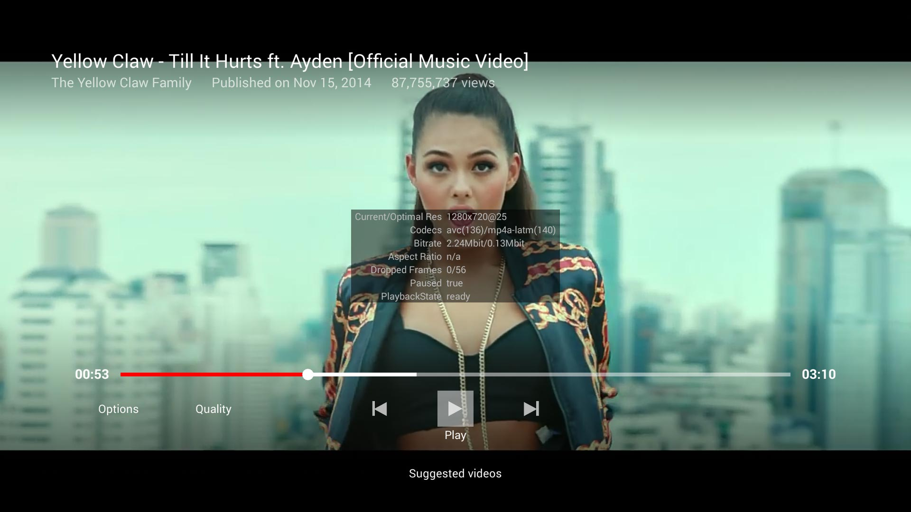
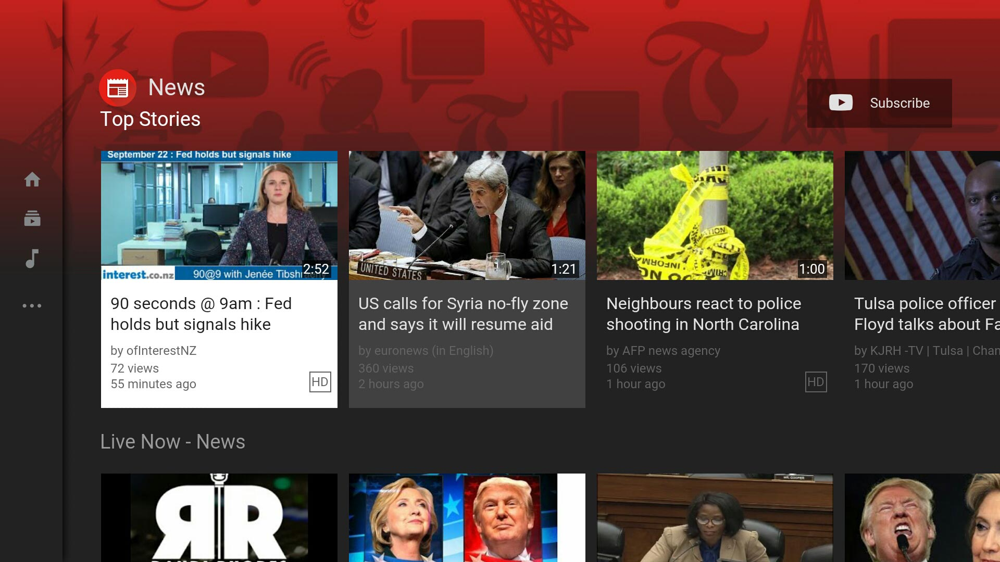
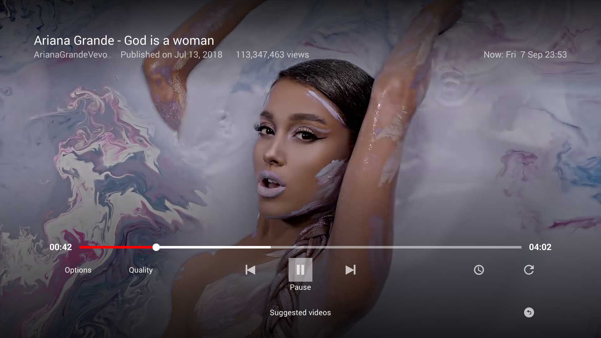
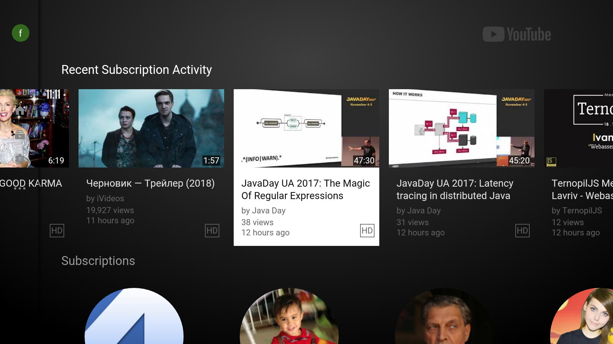
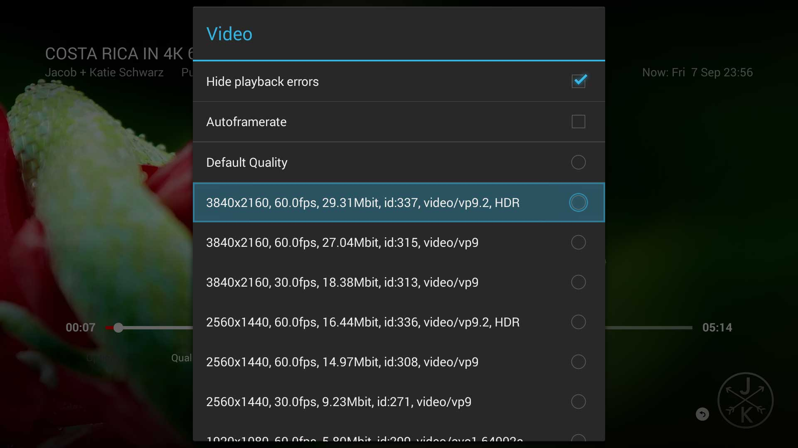

"[SmartYouTubeTV] is being sponsored by the following tool; please help to support us by taking a look and signing up to a free trial"

 SmartYouTubeTV
=========

__SmartYouTubeTV: A YouTube client for set-top boxes and Android-based TVs:__

<!--  * <a href="https://t.me/SmartYouTubeTV">Telegram group</a>
 * <a href="https://smartyoutubetv.github.io/#disqus_thread" target="_blank">Visit discussion on the official page</a> -->

### Features:

 * __4K support.__
 * Designed for TV screens.
 * Any remote controller support.
 * Login support.
 * Doesn't depend on Google Services.
 * Fully localized.
 * Multilingual search keyboard.
 * Automatic update mechanism.
 * __No root required!__

__NOTE: SmartYouTubeTV provides internal login mechanism which allows you to keep content up to date in a very convenient way.__

### Screenshots:
 * [Open screenshots](#screens)

### Install SmartYouTubeTV:

__Easy installation in less than 5 minutes with only the FireTV__
 * <a href="https://github.com/yuliskov/SmartTubeLegacy/wiki/Install-SmartYouTubeTV-(only-FireTV-needed)">Install SmartYouTubeTV (only FireTV needed)</a>

__Standard installation via ADB__
 * If you don't know how to sideload/install apps via ADB, read a tutorial (e.g. <a href="http://kodi.wiki/view/HOW-TO:Install_Kodi_on_Fire_TV" target="_blank">this one</a>)
 * <a href="https://github.com/yuliskov/SmartTubeLegacy/releases" target="_blank">Download latest SmartYouTubeTV APK</a> and sideload/install with adb: 
 * *adb install -r SmartYouTubeTV_Orig.apk*
 * Enjoy :)

__How to change system language with only the MiTV3__
 * [How-to-enable-English-on-Android-5.1](https://github.com/yuliskov/SmartTubeLegacy/wiki/How-to-enable-English-on-Android-5.1)

### Starting screen:

The device/resolution options at start launches different playing methods (as per https://github.com/yuliskov/SmartTubeLegacy/issues/15#issuecomment-364805950)
* 1080 Main - WebView
* 1080 Alt  - XWalk
* 4K Main   - Exoplayer + WebView
* 4K Alt    - Exoplayer + XWalk

Also important, it's possible to select max resolution and codec (ie 1080/AVC1) via the start screen that will be applied on video loading (**Codec** option).

The **Remember** tick box acts as a configuration saving for next app launches.
 
<!-- ### Reviews / Articles:
 * [__Official site__](https://smartyoutubetv.github.io)
 * [__XDA thread__](https://forum.xda-developers.com/fire-tv/themes-apps/modified-version-smart-youtube-tv-t3773384) -->
 
<!-- ### Changelog:
 * [Check releases page for changelog ..](https://github.com/yuliskov/SmartTubeLegacy/releases) -->

### Contributors:
 * __[WolfganP](https://github.com/WolfganP)__ (README)
 * __[javierpz](https://github.com/javierpz)__ (cast fix)
 * __[TheRMaverick](https://github.com/TheRMaverick)__ (German language)
 * __[Maikell84](https://github.com/Maikell84)__ (misc fixes)
 * __[foreveryoungforty](https://github.com/foreveryoungforty)__ (Dutch language)
 * __[bubuleur](https://github.com/bubuleur)__ (French language)
 * __[otava5](https://github.com/otava5)__ (Czech language)
 * __[WaggBR](https://github.com/WaggBR)__ (Brazilian Portuguese language)
 * __[itzxeon78](https://github.com/itzxeon78)__ (Spanish language)

### Screens:

<!--  -->

<!--  -->

